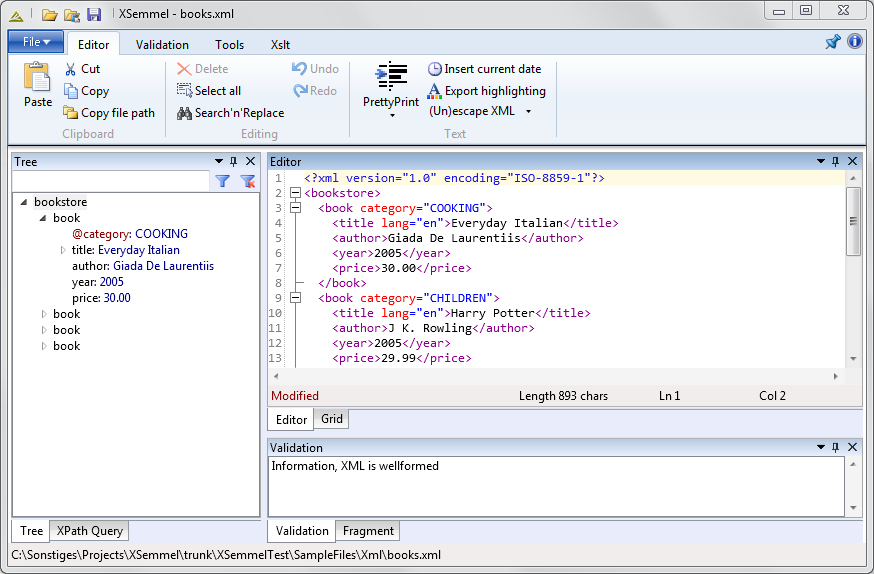

# XML editor and viewer

Click [here to download Xsemmel](https://xsemmel.codeplex.com/releases).

See [Changelog](Changelog) to check latest changes.

## Features

* XML editing
	* xsd-based code completion
	* pretty printing
* validate against XSD schema
* xsd visualizer
* grid view
* generate sample XML based on XSD
* tree view
	* navigate with tree
	* show only XML fragments
	* generate XPath of selected node
* XPath queries
	* auto-detect namespace
	* user-defined functions (C#)
* generate complex XML files based on pattern language
* generate XSD schema based on sample XML file
* compare XML files
* XSLT transformation
* XQuery
* bulk XSD validation of many XML files at once
* bulk XPath processing of many files at once

## Screenshot

## Awards

